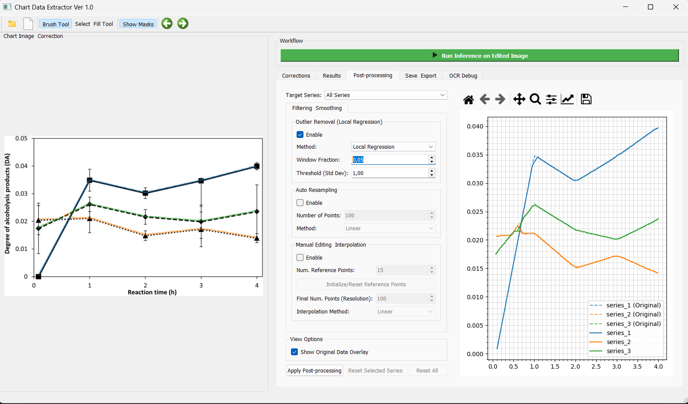

# PloXt - Chart Data Extractor

> **Caution: Alpha Version**
> This is Alpha version 1.0.1. The application is under active development and may contain bugs or produce faulty results. Please use with this in mind and report any issues you encounter.

PloXt is a powerful desktop application designed to automatically extract numerical data from scientific chart and plot images. Using a combination of deep learning models and an interactive graphical user interface, it converts visual information back into usable data formats like CSV and .mat.



---

## Features

*   **Versatile Input:** Load chart images directly (`.png`, `.jpg`) or extract them automatically from PDF documents.
*   **AI-Powered Extraction:**
    *   **Line Segmentation:** A Swin Transformer-based model accurately detects data series lines.
    *   **Component Detection:** A YOLO model identifies key plot elements like the plot area, axis titles, and tick labels.
    *   **Text Recognition:** EasyOCR reads axis values and titles, with support for rotated text.
*   **Interactive Correction UI:**
    *   Easily correct misread OCR values for ticks and titles.
    *   Visually adjust the position of axis ticks by dragging them.
    *   Rename, delete, or duplicate data series.
*   **Advanced Post-Processing:**
    *   **Outlier Removal:** Clean your data using robust methods like Local Regression or RANSAC.
    *   **Resampling & Smoothing:** Resample data to a uniform number of points using Linear, Cubic Spline, or Savitzky-Golay interpolation.
    *   **Manual Point Editing:** Interactively drag and edit data points on the recreated plot for fine-grained control.
*   **Logarithmic Scale Support:** Automatically detects and handles both linear and logarithmic scales on both axes.
*   **Multiple Export Formats:** Save your final, cleaned data as a consolidated `.csv` file or a structured `.mat` file for use in MATLAB.

## Core Technologies

*   **GUI:** PyQt5
*   **Line Segmentation:** MMDetection (Mask2Former with Swin Transformer backbone)
*   **Object Detection:** Ultralytics YOLO
*   **Text Recognition:** EasyOCR
*   **Data Handling:** Pandas, NumPy, SciPy
*   **Plotting:** Matplotlib

## Installation

The application is designed to run on a system with an NVIDIA GPU and CUDA installed.

### Prerequisites
*   Python 3.9+
*   NVIDIA GPU with CUDA 11.7 (The installation scripts are configured for this version. You may need to adjust PyTorch installation for other CUDA versions).
*   Git

### Windows

1.  **Clone the repository:**
    ```bash
    git clone https://github.com/your-username/ploXt.git
    cd ploXt
    ```
    *(Note: Replace the URL with your actual repository URL.)*

2.  **Run the installation script:**
    This script will create a Python virtual environment (`venv`), activate it, and install all necessary dependencies, including PyTorch for CUDA 11.7 and MMDetection.

    ```cmd
    .\install.cmd
    ```

### Linux / macOS (with Conda)

It is highly recommended to use Conda for managing the environment on Linux/macOS.

1.  **Clone the repository:**
    ```bash
    git clone https://github.com/your-username/ploXt.git
    cd ploXt
    ```

2.  **Create and activate a Conda environment:**
    ```bash
    conda create --name ploxt python=3.9 -y
    conda activate ploxt
    ```

3.  **Run the installation script:**
    This script will install PyTorch and all other dependencies into your active Conda environment.
    ```bash
    bash install.sh
    ```

## Usage

1.  **Activate the virtual environment:**
    *   **Windows:** `.\venv\Scripts\activate`
    *   **Linux (Conda):** `conda activate ploxt`

2.  **Run the application:**
    ```bash
    python main.py
    ```

### Basic Workflow

1.  **Load:** Use the "Open Image" or "Open PDF" button to load your chart. If using a PDF, a dialog will appear allowing you to select the desired chart.
2.  **Run Inference:** Click the "Run Inference" button. The models will process the image, and the results will populate the UI tabs.
3.  **Correct:** Go to the "Corrections" tab.
    *   Fix any incorrect text in the title or axis tick value fields.
    *   Use the "Correct Tick Positions" tool to drag axis lines to their correct location.
    *   Click "Apply All Corrections" to recalculate the data.
4.  **Post-process:** Go to the "Post-processing" tab.
    *   Select a series to work on.
    *   Enable and configure outlier removal, resampling, or manual editing.
    *   Click "Apply Post-processing" to commit the changes.
5.  **Export:** Go to the "Save & Export" tab and choose your desired format (CSV or .mat).

### Troubleshooting

**Problem: Installation fails on `mmcv-full` or PyTorch.**

*   **Cause:** This is often due to an incompatibility between your installed NVIDIA driver, your CUDA toolkit version, and the PyTorch version specified in the script. The scripts are hardcoded for **CUDA 11.7**.
*   **Solution:**
    1.  Check your CUDA version by running `nvidia-smi` in your terminal.
    2.  Visit the PyTorch previous versions page to find the correct installation command for your specific CUDA version.
    3.  Modify the `pip install torch...` line in `install.cmd` or the `conda install pytorch...` line in `install.sh` with the command you found.
    4.  You may also need to find a compatible `mmcv-full` version.

## Contributing

This project is in its early stages, and feedback is highly welcome! If you encounter a bug, have a feature request, or want to contribute.


---


